# Gamebuino Classic → Vircon32

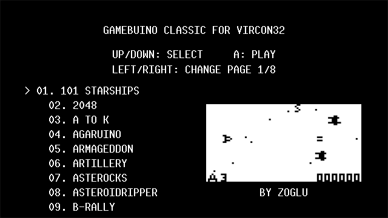

A [Vircon32](https://www.vircon32.com/) cartridge that ports 110 games from
the [Gamebuino Classic](https://github.com/Gamebuino/Gamebuino-Classic)
library (an Arduino-based handheld with an 84x48 Nokia 5110/PCD8544
monochrome display and 7 real digital buttons) behind one shared
game-select menu - the same overall shape as the sibling
[tinyjoypad_vircon32](https://github.com/joyrider3774/tinyjoypad_vircon32) project, reusing its menu
system and column-atlas rendering trick, adapted for Gamebuino Classic's
own smaller display and genuinely-classed, real-framebuffer API instead of
TinyJoypad's byte-stream one.

Vircon32's GPU is a texture-region blitter with no CPU-writable
framebuffer, so display output is routed through a 256-tile "column atlas"
(one pre-baked texture tile per possible PCD8544 byte value) instead of
writing pixels directly - see `CLAUDE.md` for the full architecture
writeup.

This port was built with the help of Claude AI (Anthropic), directly
reusing the methodology and much of the shared infrastructure already
proven in the sibling `tinyjoypad_vircon32` project.

## Controls

| Console input | Used for |
|---|---|
| D-pad | Move / navigate the menu |
| Button A | Confirm / Gamebuino's own Button A |
| Button B | Gamebuino's own Button B |
| Button X | Gamebuino's own Button C |
| Button Y | Toggle sound on/off globally - works on the menu, mid-game, and during the quit-confirmation dialog |
| Button L | Toggle a pixel-grid overlay on/off - works everywhere like the two toggles around it, though the overlay itself only draws over a running game |
| Button R | Cycle the three GB_GRAY renderings - **GRAY1** (solid, the default): a real, flat gray. **GRAY2**: real LCD persistence, the way the Simbuino emulator shows it - a pixel toggled on alternating ticks never fully settles either way, so the dither is seen as a steady middle shade, and anything else a game flickers smears the same way. **GRAY0**: real hardware's own raw frame-alternating checkerboard dither, unsmeared. Works globally (menu, mid-game, dialog) like the mute toggle above; the menu's own badge names the active mode |
| Button Start | Pause mid-game and open the quit-confirmation dialog (YES/NO, defaults to NO) |

The state of all three toggles is shown as a row of badges in the menu's
own top-right corner - `SND` / `GRAY0`-`GRAY1`-`GRAY2` / `GRID`, white when
on and dim when off - and flipping any of them briefly flashes a message at
the bottom of the screen, mid-game included, so a press is always
acknowledged.

Which physical keyboard key or real gamepad button maps to which of these
is up to the Vircon32 emulator's own input configuration - this cartridge
doesn't assume a specific keyboard layout.

## License

This project is **GPLv3** (`LICENSE.txt`): several of the games shipped in
this cartridge (Agaruino, CrazyCar, Shufflepuck Cafe, Taquin) are
themselves GPLv3, and combining GPLv3 code into one cartridge binary makes
the cartridge as a whole a GPLv3 combined work. This covers this project's
own new code (the shim layer, the menu, `portVircon32.c`) - each individual
game's own original license/attribution is preserved unmodified in its own
header comment in `src/games/`, and is also listed per-game in the table
below.

**Known concern**: Firemen's own upstream `LICENSE.md` says only "GPL V2",
with no "or later version" clause found - GPLv2-only code is not
license-compatible with GPLv3 the way every other GPL'd game in this
cartridge (all GPLv3) is, so combining it into this same GPLv3 binary as-is
is a real, unresolved licensing conflict, not just a compatible-license
bookkeeping detail. Flagged here rather than silently ignored; not yet
resolved.

## How these ports are built

Every game below is a real, faithful port of its actual upstream C/C++
source - not a rewrite. The same handful of translation patterns recur
across almost all 99, since this dialect (see `VIRCON32_C_DIALECT.md`)
diverges from standard C/C++ in a few consistent ways:

- **C++ classes → plain structs + free functions.** No classes/methods in
  this dialect, so every real class becomes a named `struct` plus
  functions taking an explicit pointer (or array index, for games with
  multiple instances like bullets/enemies).
- **Blocking loops → explicit state machines.** Real `gb.titleScreen()`/
  `gb.menu()`-style blocking calls become named states in a flat
  `switch`/`if-else` chain, since a game may only run one `gbUpdate()`/
  `gbRenderFrame()` pair per engine tick.
- **Struct-by-value returns → out-pointers.** Functions can't return more
  than one word here, so anything upstream returned by value (a vector, a
  small struct) takes an extra output-pointer parameter instead.
- **No ternary operator.** Every `a ? b : c` becomes an explicit
  `if`/`else`.
- **Bitmap data ported byte-for-byte**, converting Arduino's `B01011010`
  binary literals to hex where needed, with element counts checked
  against each bitmap's own declared size rather than hand-transcribed.
- **EEPROM saves use a fresh-cell sentinel check** (`==0xFFFF`/
  `==0xFFFFFFFF`) before trusting a value read off a blank card, matching
  real hardware's own factory-erased state.
- **Narrow AVR integer types are audited by hand where they matter.** This
  dialect's `int` is always a full 32-bit word (no 8/16-bit narrowing or
  wraparound), so anywhere real upstream code relied on that - especially
  composed EEPROM values - was traced through and fixed if the two
  platforms would actually diverge.
- **Real upstream bugs are preserved, not fixed by default** - including
  gameplay quirks that look like mistakes - unless they'd crash, hang, or
  make the game genuinely unplayable on this platform specifically, or (a
  smaller set, fixed on direct request) were judged a genuine negative hit
  to player experience. See [BUGS.md](BUGS.md) for the full list of what's
  deliberately preserved vs. what was fixed and why.
- **Sound is a real port of the actual tracker/pattern/track engine**
  (notes, patterns, tracks, and instrument envelopes/slide/arpeggio/
  tremolo commands), not just one-shot tones - with one real, documented
  gap: **there is no noise instrument.** Real hardware drives its speaker
  from a genuine pseudorandom noise generator for any instrument step
  flagged as noise (e.g. `playTick()`); this port has no noise waveform at
  all, so a noise-flagged step plays as a plain tone at the same pitch/
  duration instead. Each game also gets its own short, unique global/
  function name prefix to keep 110 games' worth of C code collision-free in
  one shared build.

## Games

Click a thumbnail for the full-size screenshot. Every game here runs on
the same real Gamebuino Classic hardware (an ATmega328 driving an 84x48
PCD8544/Nokia 5110 display). In the cartridge's own menu, a handful of
titles are shown in **red text** instead of white - a plain visual
"known unfinished" warning (e.g. missing scoring/win-lose conditions,
built from a genuinely incomplete upstream source, or a known bug like a
ball that can get stuck). They're still fully selectable and playable
like any other game, just flagged.

The table also includes **Sound Test**, which uses the same red-text
flagging but for a different reason: it's not a ported game at all, just
an in-cartridge diagnostic tool for exercising the sound shim's own
primitives directly (`playOK()`/`playCancel()`/`playTick()`, a raw pitch
sweep, and a few instrument/volume/slide extras).

| Game | Author | License | Save | Source | Screenshot |
|---|---|---|---|---|---|
| 101 Starships | Zoglu | None | — | zoglu.net (no stable link) |  |
| A to K | Carlos Mari | CC-BY 4.0 (+ no-selling note) | ✅ | carloslabs.com (no stable link) |  |
| Aerial-Assault | SkylarHylar | None | — | [Strike Down](https://github.com/SkylarHylar/Strike-Down) | [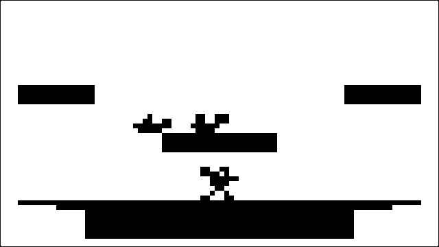](<metadata/screenshots/AERIAL-ASSAULT.png>) |
| Agaruino | ogbaba | GPLv3 | — | [Agaruino](https://github.com/ogbaba/Agaruino) | [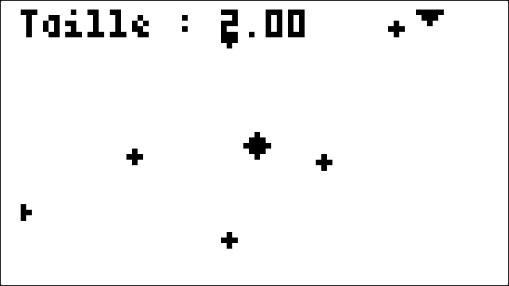](metadata/screenshots/AGARUINO.png) |
| Aimbuino | Baptiste Pouget (hosted under ogbaba's account) | GPLv3 | ✅ | [Aimbuino](https://github.com/ogbaba/Aimbuino) | [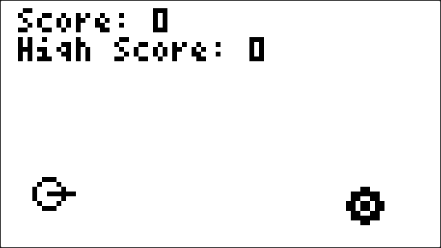](metadata/screenshots/AIMBUINO.png) |
| Another 2048 | grafMakulaDer2te | None | — | [another2048](https://github.com/grafMakulaDer2te/another2048) |  |
| Armageddon | wuuff | GPLv3 | ✅ | [armageddon](https://github.com/wuuff/armageddon) | [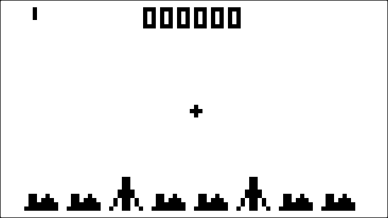](metadata/screenshots/ARMAGEDDON.png) |
| Artillery | Frakasss | None | — | [Artillery](https://github.com/Frakasss/Artillery) | [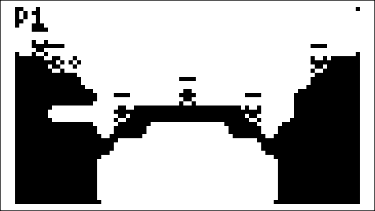](metadata/screenshots/ARTILLERY.png) |
| Asterocks | Yoda Zhang | None | ✅ | [yodasvideoarcade.com](https://yodasvideoarcade.com/gamebuino.php) | [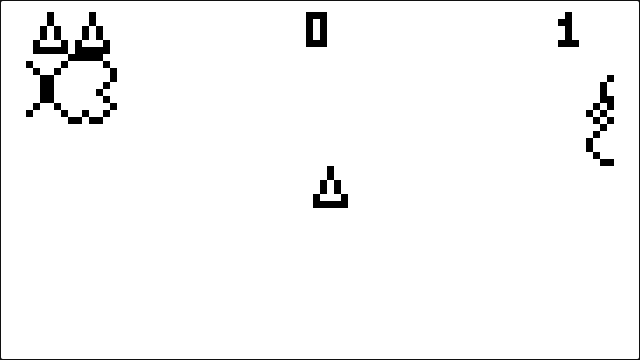](metadata/screenshots/ASTEROCKS.png) |
| AsteroidRipper | ripper121 | None | — | Recovered via direct download (no stable link) | [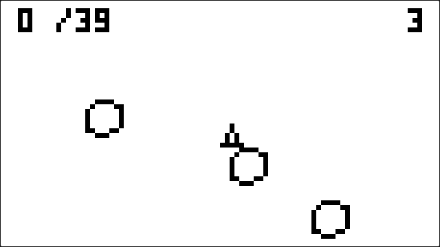](metadata/screenshots/ASTEROIDRIPPER.png) |
| B-Rally | scmar | MIT | ✅ | [B Rally](https://github.com/scmar/B-Rally) | [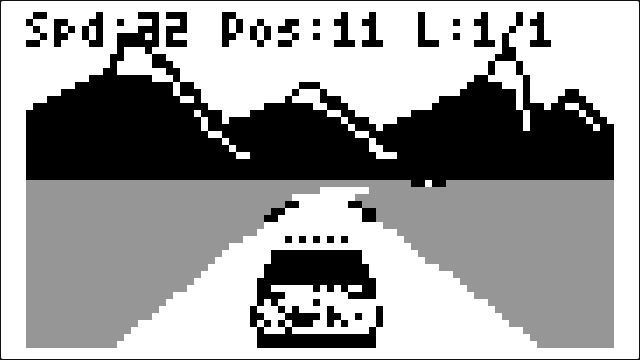](<metadata/screenshots/B-RALLY.png>) |
| Bang! Bang! | RackhamLeNoir | GPLv3 | — | [gamebuino bangbang](https://github.com/RackhamLeNoir/gamebuino-bangbang) |  |
| BigBlackBox | STUDIOCRAFTapps | Custom (non-commercial, keep credit - see source) | ✅ | [akkera102 08 gamebuino](https://github.com/akkera102/08_gamebuino) | [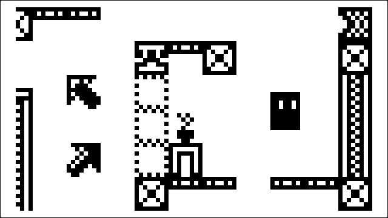](metadata/screenshots/BIGBLACKBOX.png) |
| Blob Attack | LudumDareDevelopment | None | ✅ | [Blob Attack](https://github.com/LudumDareDevelopment/Blob-Attack) |  |
| Blockdude | Sorunome | None | ✅ | [blockdude gamebuino](https://github.com/Sorunome/blockdude-gamebuino) | [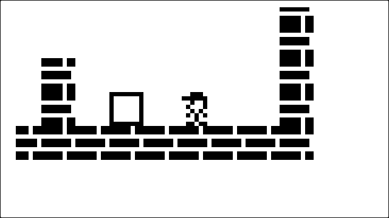](metadata/screenshots/BLOCKDUDE.png) |
| BlocksBuino | frthery | None | — | [BlocksBuino](https://github.com/frthery/BlocksBuino) | [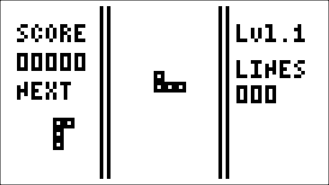](metadata/screenshots/BLOCKSBUINO.png) |
| Bomber | Clement83 | None | — | [Bomber](https://github.com/Clement83/Bomber) | [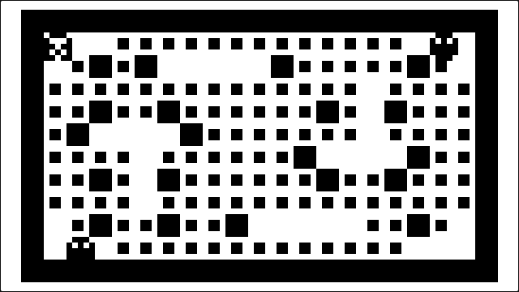](metadata/screenshots/BOMBER.png) |
| Bomberman | JohnAkerman | None | — | [Gamebuino-Bomberman](https://github.com/JohnAkerman/Gamebuino-Bomberman) | [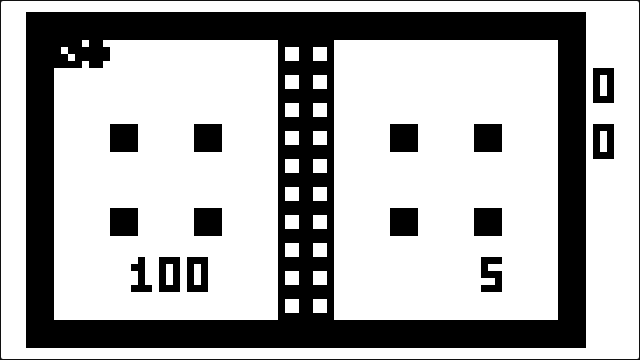](<metadata/screenshots/BOMBERMAN.png>) |
| Breakout Ripper | ripper121 | None | — | Recovered via direct download (no stable link) |  |
| Bricks! | Drakker | None | — | [Bricks!](https://web.archive.org/web/*/drakker.org*) (recovered from a Wayback Machine snapshot) | [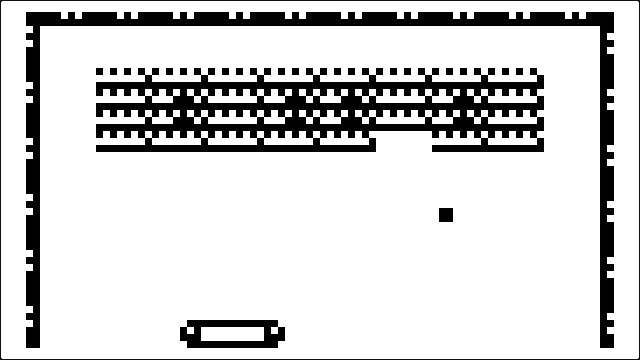](<metadata/screenshots/BRICKS%21.png>) |
| Bub | smogheap | GPLv3 | ✅ | [smogheap.github.io/bub](https://smogheap.github.io/bub/) | [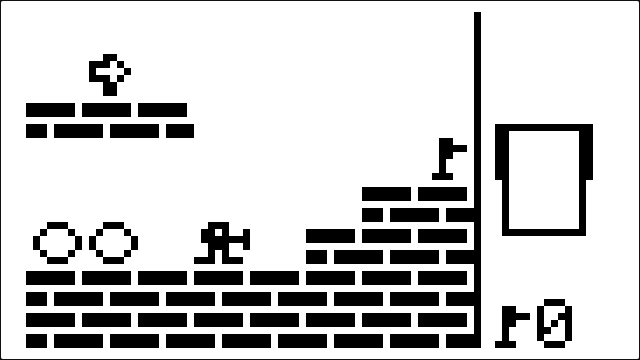](metadata/screenshots/BUB.png) |
| Castle Defence | kh9282 | None | ✅ | [CastleDefence](https://github.com/kh9282/CastleDefence) |  |
| Catcher | qubist | None | — | [Gamebuino Catcher](https://github.com/qubist/Gamebuino-Catcher) | [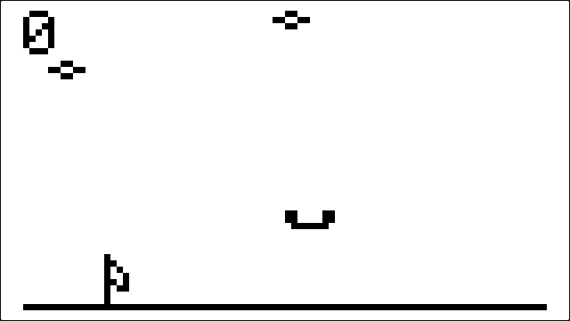](metadata/screenshots/CATCHER.png) |
| Community RPG | Sorunome | None | — | [gamebuino community rpg](https://github.com/Sorunome/gamebuino-community-rpg) |  |
| Conduit | adekto | MIT | — | [conduit](https://github.com/adekto/conduit) | [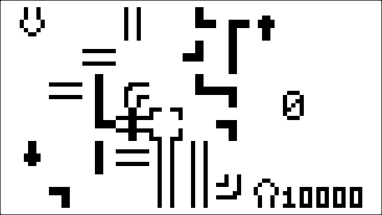](metadata/screenshots/CONDUIT.png) |
| Copter | Clement83 | None | — | [Copter](https://github.com/Clement83/Copter) | [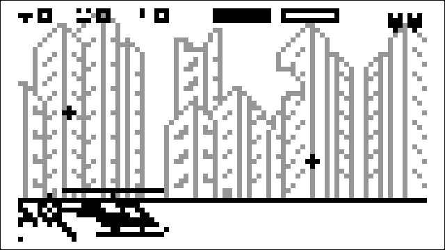](metadata/screenshots/COPTER.png) |
| Copter (by Anny) | annyfm | None | — | [Gamebuino-Copter](https://github.com/annyfm/Gamebuino-Copter) |  |
| CopterStrike | Frakasss | None | — | [CopterStrike](https://github.com/Frakasss/CopterStrike) | [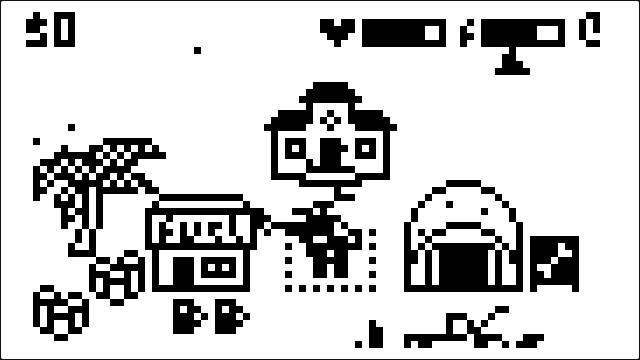](metadata/screenshots/COPTERSTRIKE.png) |
| Crabator | Rodot | None | ✅ | [Crabator](https://github.com/Rodot/Crabator) | [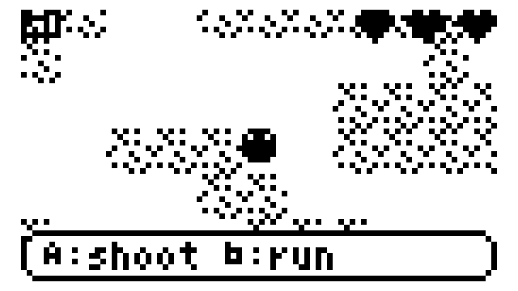](metadata/screenshots/CRABATOR.png) |
| CrazyCar | Baptiste Pouget | GPLv3 | — | [CRAZYCAR Gamebuino](https://github.com/baptistepouget/CRAZYCAR-Gamebuino) | [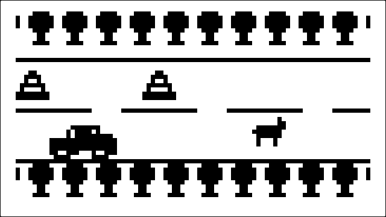](metadata/screenshots/CRAZYCAR.png) |
| CrazyTown | Clement Quintard | None | ✅ | [CrazyTown](https://github.com/Clement83/CrazyTown) | [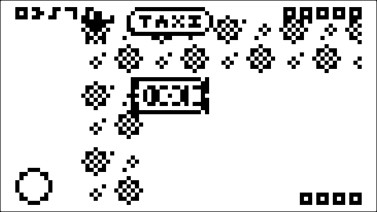](metadata/screenshots/CRAZYTOWN.png) |
| Cruiser | Michael Specht | None | — | [cruiser](https://github.com/specht/cruiser) | [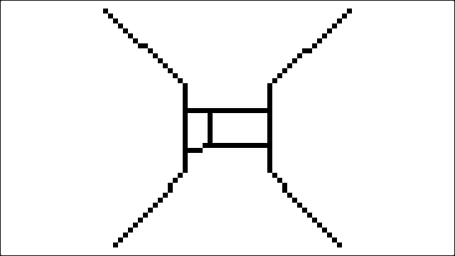](metadata/screenshots/CRUISER.png) |
| Dark Tower | Marcus Hutchings | GPLv3 | — | [DarkTower](https://github.com/marcushutchings/DarkTower) |  |
| DarkShmup | Clement83 | None | — | [DarkShmup](https://github.com/Clement83/DarkShmup) | [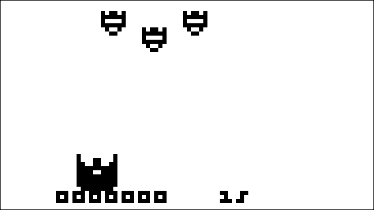](metadata/screenshots/DARKSHMUP.png) |
| DeathMaze | msevilgenius | None | ✅ | Recovered via direct download (no stable link) | [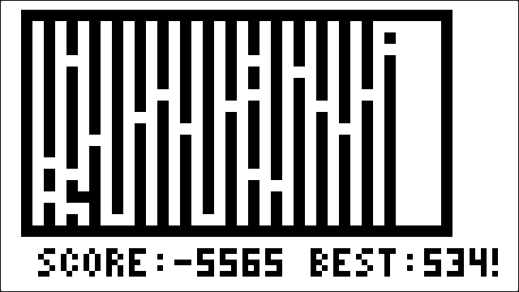](metadata/screenshots/DEATHMAZE.png) |
| Descent into Hell | etienne72230 | None | ✅ | [DescentIntoHeel](https://github.com/etienne72230/DescentIntoHeel) |  |
| Digger | scmar | None | ✅ | [Digger](https://github.com/scmar/Digger) | [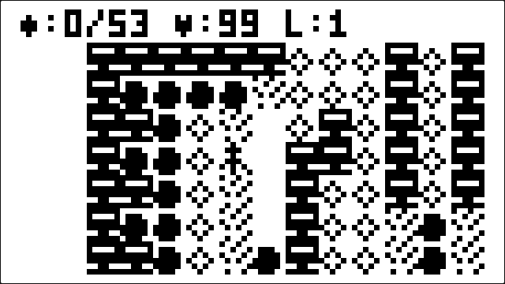](metadata/screenshots/DIGGER.png) |
| Discovery | FirstKlaas | None | — | [discovery](https://github.com/FirstKlaas/discovery) | [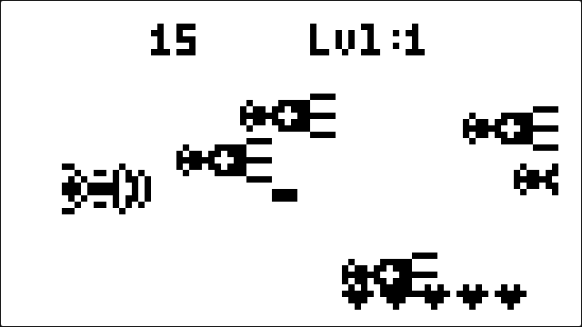](<metadata/screenshots/DISCOVERY.png>) |
| Elventure | trodoss (original, TEAM a.r.g.) / wuuff (Gamebuino port) | GPLv3 | — | [Elventure](https://github.com/wuuff/Elventure) | [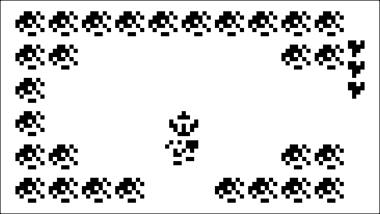](metadata/screenshots/ELVENTURE.png) |
| Fifteen | Tnxec2 | None | ✅ | [fifteen](https://github.com/Tnxec2/fifteen) | [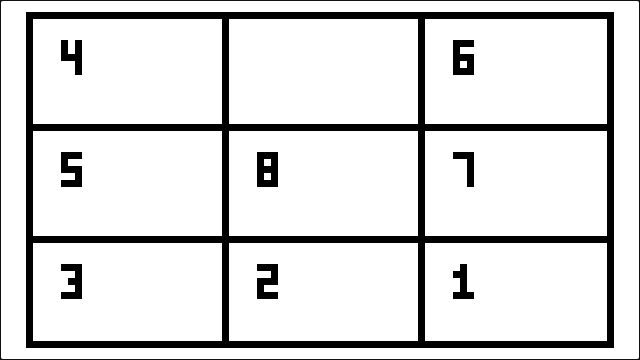](metadata/screenshots/FIFTEEN.png) |
| FireBuino! | LADBSoft | LGPLv3 | ✅ | [makerbuino firebuino](https://github.com/ladbsoft/makerbuino-firebuino) | [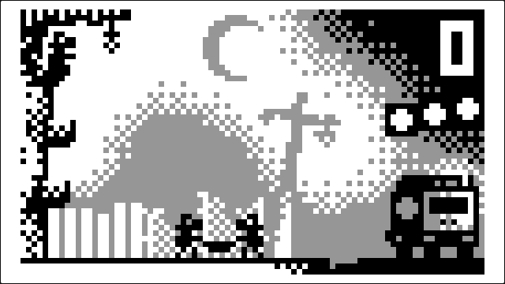](metadata/screenshots/FIREBUINO.png) |
| Firemen | Vicking69 | GPLv2 | ✅ | [firemen](https://github.com/Vicking69/firemen) | [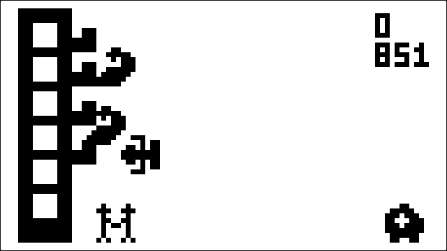](metadata/screenshots/FIREMEN.png) |
| Flappy Birdo | Forklift5 | None | ✅ | [FlappyBirdo](https://github.com/Forklift5/FlappyBirdo) |  |
| Footlol | Baptiste Pouget (hosted under ogbaba's account) | GPLv3 | — | [FOOTLOL Gamebuino](https://github.com/ogbaba/FOOTLOL-Gamebuino) | [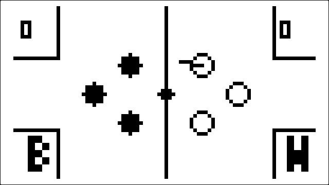](metadata/screenshots/FOOTLOL.png) |
| Gamebuino2048 | Josiah Winslow | None | ✅ | Mediafire (no stable link) | [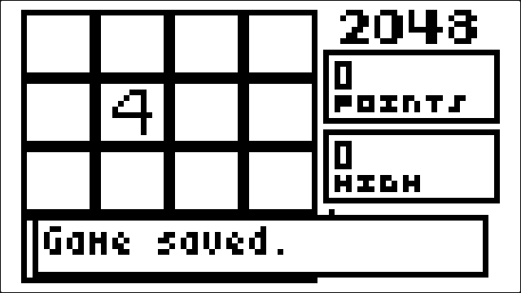](metadata/screenshots/2048.png) |
| Gemgem | Tnxec2 | None | ✅ | [gemgem gamebuino](https://github.com/Tnxec2/gemgem-gamebuino) | [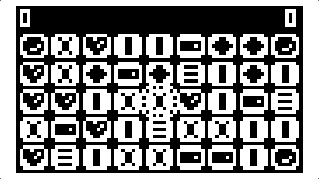](metadata/screenshots/GEMGEM.png) |
| GlaciGlaca | Clement83 | None | — | [GlaciGlaca](https://github.com/Clement83/GlaciGlaca) | [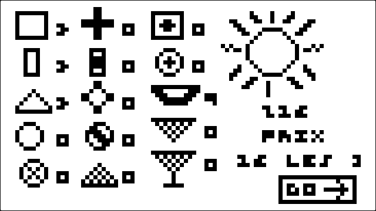](metadata/screenshots/GLACIGLACA.png) |
| Gruniozerca | Arkadiusz Kaminski (arhneu) | Unlicense | ✅ | [gruniozerca gamebuino](https://github.com/arhneu/gruniozerca-gamebuino) | [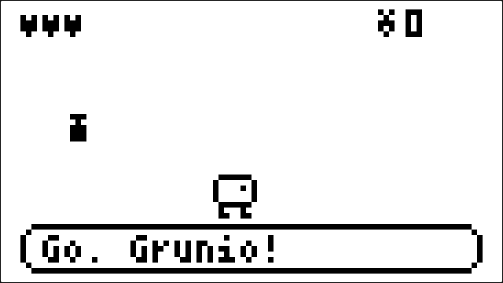](metadata/screenshots/GRUNIOZERCA.png) |
| Guess A Number | l_et_m | None | — | [GuessANumber](https://github.com/l-et-m/GuessANumber) |  |
| Invaders | Yoda Zhang | None | ✅ | [yodasvideoarcade.com](https://yodasvideoarcade.com/gamebuino.php) | [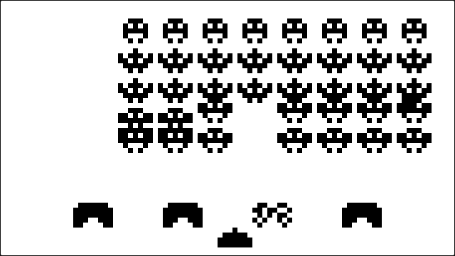](metadata/screenshots/INVADERS.png) |
| Jezzball | RackhamLeNoir | GPLv3 | ✅ | [gamebuino jezzball](https://github.com/RackhamLeNoir/gamebuino-jezzball) | [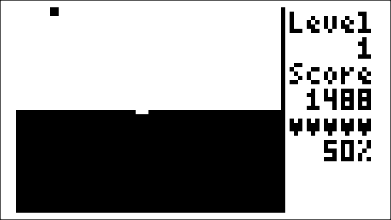](metadata/screenshots/JEZZBALL.png) |
| Kill Race | Yoda Zhang | None | ✅ | [yodasvideoarcade.com](https://yodasvideoarcade.com/gamebuino.php) |  |
| Lander | Yoda Zhang | None | ✅ | [yodasvideoarcade.com](https://yodasvideoarcade.com/gamebuino.php) | [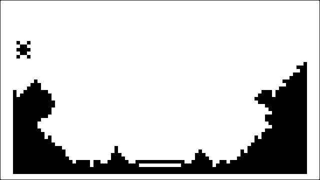](metadata/screenshots/LANDER.png) |
| Lights Out AD | 94k | WTFPL | — | Recovered via direct download (no stable link) |  |
| Maruino | ajsb113 | None | — | Dropbox (no stable link) | [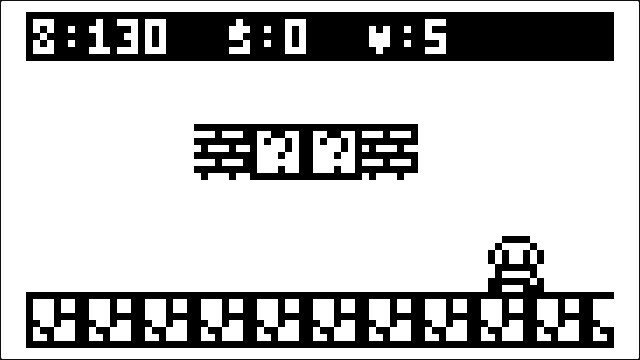](metadata/screenshots/MARUINO.png) |
| Master Kebab | ogbaba | GPLv3 | ✅ | [RMKebab](https://github.com/ogbaba/RMKebab) |  |
| Maze | Andy O'Neill | MIT | — | [gamebuino maze](https://github.com/aoneill01/gamebuino-maze) | [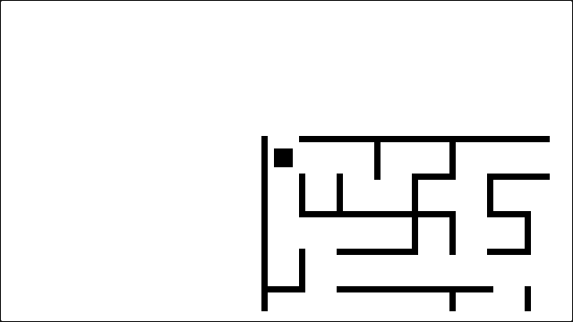](metadata/screenshots/MAZE.png) |
| microHexagon | valdenthoranar | None | ✅ | [microhexagon](https://bitbucket.org/valdenthoranar/microhexagon) | [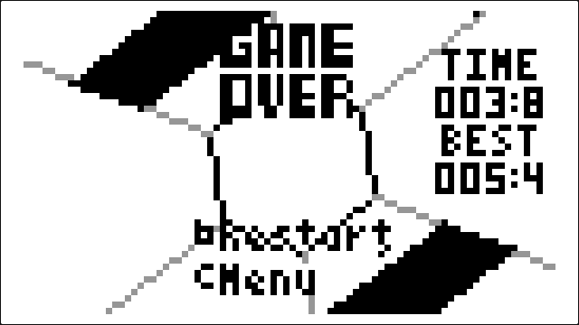](metadata/screenshots/MICROHEXAGON.png) |
| Minesweeper | dirksteindorf | None | — | [Gamebuino Minesweeper](https://github.com/dirksteindorf/Gamebuino-Minesweeper) | [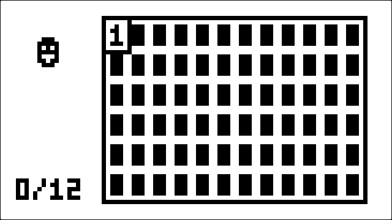](metadata/screenshots/MINESWEEPER.png) |
| Mole Control | grafMakulaDer2te | None | — | [mole control](https://github.com/grafMakulaDer2te/mole-control) |  |
| MotoCross | Clement83 | None | — | [MotoCross](https://github.com/Clement83/motoCross) | [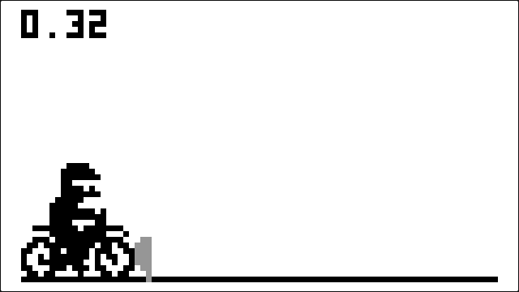](metadata/screenshots/MOTOCROSS.png) |
| MyRPG | Frakasss | None | — | [MyRPG](https://github.com/Frakasss/MyRPG) | [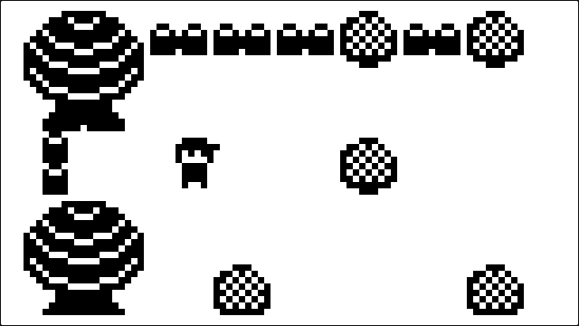](metadata/screenshots/MYRPG.png) |
| No Name Platform Game | Frakasss | None | — | [NoNamePlatformGame](https://github.com/Frakasss/NoNamePlatformGame) |  |
| Paqman | Yoda Zhang | None | ✅ | [yodasvideoarcade.com](https://yodasvideoarcade.com/gamebuino.php) | [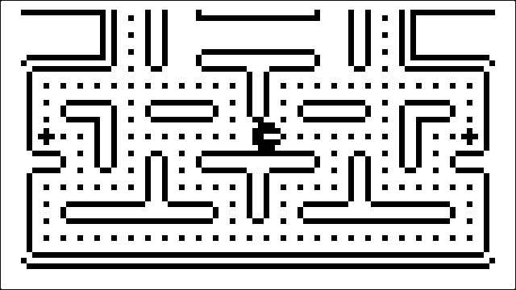](metadata/screenshots/PAQMAN.png) |
| Parachute | Jicehel | None | — | [Parachute Gamebuino](https://github.com/jicehel/Parachute_Gamebuino) | [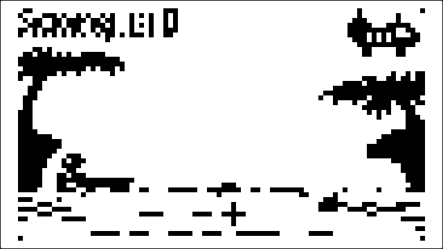](metadata/screenshots/PARACHUTE.png) |
| PetitMonstre | Clement83 | None | — | [PetitMonstre](https://github.com/Clement83/petitMonstre) | [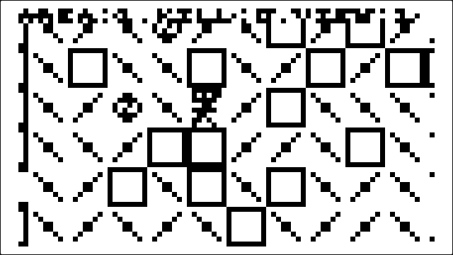](metadata/screenshots/PETITMONSTRE.png) |
| PinBall | Clement83 | None | — | [pinBall](https://github.com/Clement83/pinBall) | [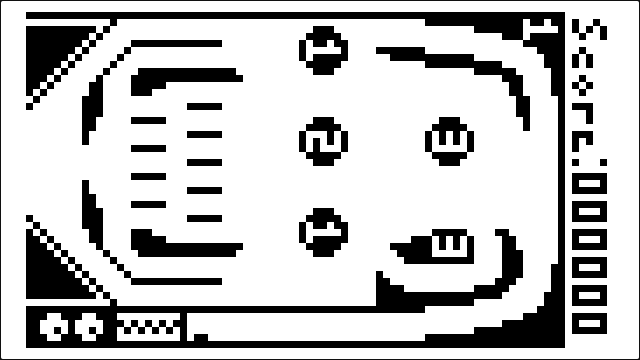](metadata/screenshots/PINBALL.png) |
| Pong 2017 | yawn-g | None | — | [pong 2017](https://github.com/yawn-g/pong-2017) |  |
| Pong Local Multiplayer | qubist | None | — | [Gamebuino PongLocalMultiplayer](https://github.com/qubist/Gamebuino-PongLocalMultiplayer) |  |
| Pong Solo | Aurelien Rodot | LGPLv3 | — | [Gamebuino Classic examples](https://github.com/Gamebuino/Gamebuino-Classic/tree/master/examples/2.Intermediate/Pong) |  |
| Punkt | Andy O'Neill | MIT | ✅ | [gamebuino punkt](https://github.com/aoneill01/gamebuino-punkt) | [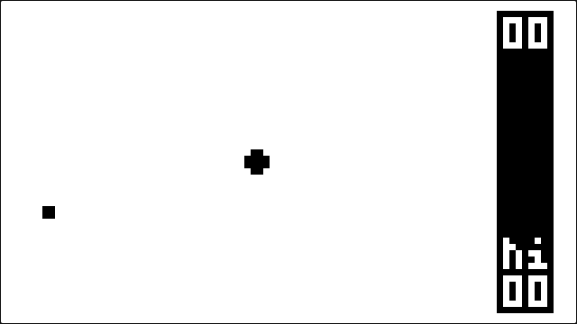](metadata/screenshots/PUNKT.png) |
| R.S.G. | deKay | None | — | [RSG-Gamebuino](https://github.com/deKay01/RSG-Gamebuino) | [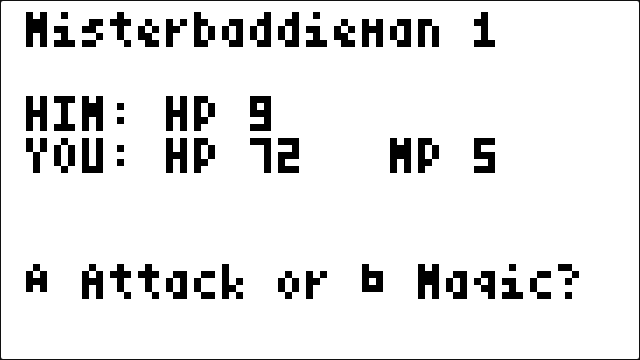](<metadata/screenshots/R.S.G..png>) |
| Ralph | Clement83 | None | — | [Ralph](https://github.com/Clement83/ralph) | [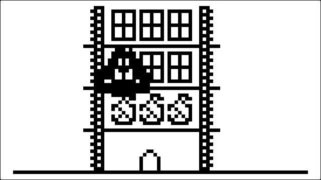](metadata/screenshots/RALPH.png) |
| Robot | Frakasss | None | — | [Robot](https://github.com/Frakasss/Robot) | [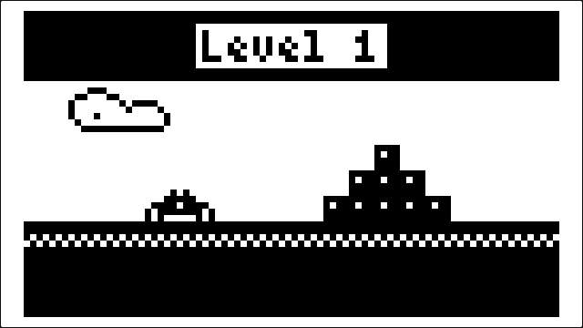](metadata/screenshots/ROBOT.png) |
| Save Princesse | Clement83 | None | — | [SavePrincesse](https://github.com/Clement83/SavePrincesse) |  |
| Senet | Maximilian Timmerkamp | Apache 2.0 | — | Recovered via direct download (originally hosted on Bitbucket, no stable link) | [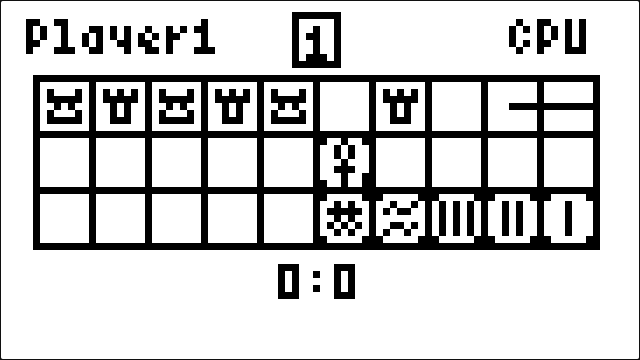](metadata/screenshots/SENET.png) |
| shipwrek | yawn-g | None | — | [shipwrek](https://github.com/yawn-g/shipwrek) | [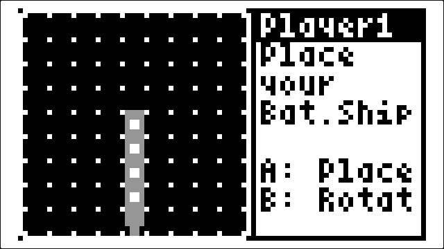](metadata/screenshots/SHIPWREK.png) |
| ShootBuino | frthery | None | ✅ | [ShootBuino](https://github.com/frthery/ShootBuino) | [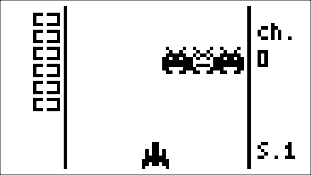](metadata/screenshots/SHOOTBUINO.png) |
| Shufflepuck Cafe | AWOT83 | GPLv3 | — | [Gamebuino Shufflepuck cafe](https://github.com/Awot83/Gamebuino-Shufflepuck_cafe) |  |
| Siena Town | Patryk Kuciński | None | EEPROM top score | [SienaTown-gamebuino](https://github.com/Kuciniak/SienaTown-gamebuino) |  |
| Simonbuino | Jerom (Forklift5) | None | — | [Simonbuino](https://github.com/Forklift5/Simonbuino) | [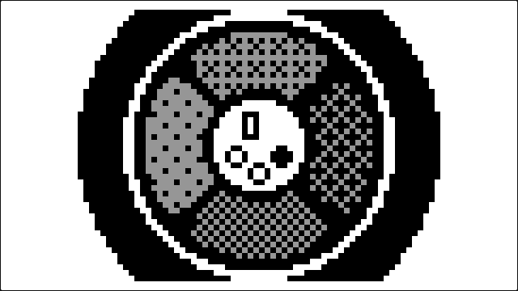](metadata/screenshots/SIMONBUINO.png) |
| Skibuino | Mike Del Pozzo | GPLv3 | ✅ | [skibuino](https://github.com/delpozzo/skibuino) | [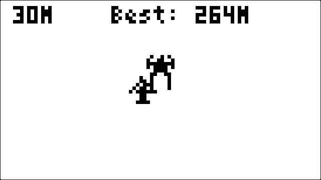](metadata/screenshots/SKIBUINO.png) |
| Smash-and-Crash | Skyrunner65 | None | — | [Smash and Crash](https://github.com/Skyrunner65/Smash-and-Crash) |  |
| Snake (Sigma-Squared) | Sigma-Squared | None | EEPROM high score | [gamebuino-snake-sigma](https://github.com/Sigma-Squared/gamebuino-snake) |  |
| Snake 5110 | Lady Awesome & MakerSquirrel | CC-BY-SA 2018 / GPLv3 (unresolved conflict, see source) | ✅ | [Gamebuino Classic Snake 5110](https://github.com/makerSquirrel/Gamebuino-Classic-Snake-5110) |  |
| Snake ABC | frthery | None | — | [SnakeAbcBuino](https://github.com/frthery/SnakeAbcBuino) |  |
| Snake Classic | Ripper121 (original), Tnxec2 (fork) | None | — | [snake gamebuino classic](https://github.com/Tnxec2/snake-gamebuino-classic) |  |
| Sokobuino | martinsustek | None | ✅ | Recovered via direct download (no stable link) | [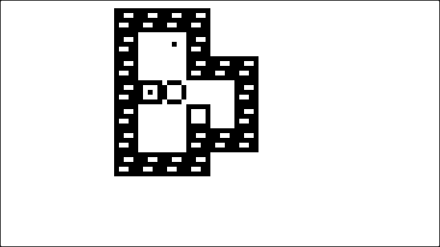](metadata/screenshots/SOKOBUINO.png) |
| Solitaire | Andy O'Neill | MIT | ✅ | [gamebuino solitaire](https://github.com/aoneill01/gamebuino-solitaire) | [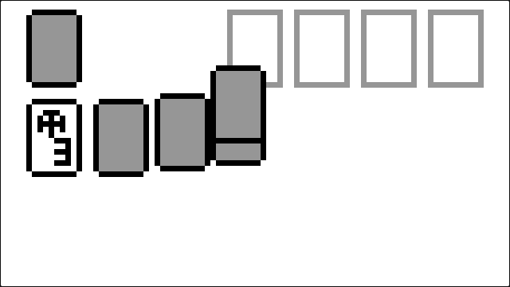](metadata/screenshots/SOLITAIRE.png) |
| Sound Test | willems davy | GPLv3 (this project's own code) | — | Not a ported game - a sound-shim diagnostic tool, see above |  |
| Spin Spin Spinbuino! | Charly Piva "Zoglu" / Margot Piva "Isil" | None | ✅ | zoglu.net (no stable link) |  |
| Star Honor | Wenceslao Villanueva Jr (original) / wuuff (Gamebuino port) | MIT | — | [StarHonor](https://github.com/wuuff/StarHonor) |  |
| StickFighter | Clement83 (art by Quirby64) | None | — | [StickFighter](https://github.com/Clement83/StickFighter) | [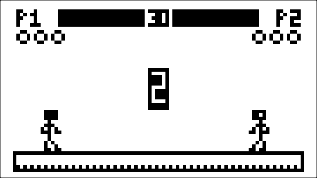](metadata/screenshots/STICKFIGHTER.png) |
| Stijn's Pong | Stijn Caerts | MIT | — | [Gamebuino (StijnCaerts)](https://github.com/StijnCaerts/Gamebuino) |  |
| Stijn's Snake | Stijn Caerts | MIT | — | [Gamebuino (StijnCaerts)](https://github.com/StijnCaerts/Gamebuino) |  |
| Super Crate Buino | Aurelien Rodot | None | ✅ | [Super Crate Buino](https://github.com/Rodot/Super-Crate-Buino) |  |
| Super Crate Buino: Stone Edition | 4LAR | None | EEPROM scores | [Super-Crate-Buino-StoneEdition](https://github.com/4LAR/Super-Crate-Buino-StoneEdition) |  |
| Super Space Shooter | msevilgenius | None | — | [Gamebuino SuperSpaceShooter](https://github.com/msevilgenius/Gamebuino-SuperSpaceShooter) |  |
| T-Rex Quest | Awot83 | GPLv3 | — | [Gamebuino TREX QUEST](https://github.com/Awot83/Gamebuino-TREX-QUEST) |  |
| Taquin | RackhamLeNoir | GPLv3 | — | [gamebuino taquin](https://github.com/RackhamLeNoir/gamebuino-taquin) | [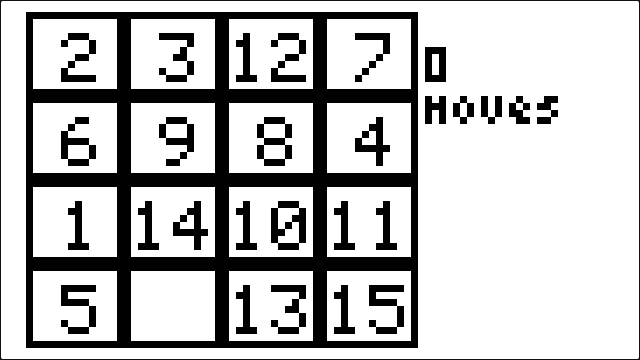](metadata/screenshots/TAQUIN.png) |
| Tetrino | j0ff | MIT | — | [tetrino](https://github.com/j0ff/tetrino) | [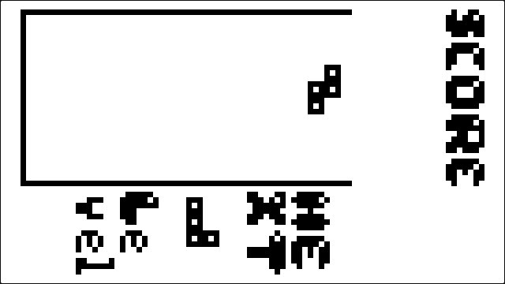](metadata/screenshots/TETRINO.png) |
| Thunder Shoot | Awot83 | GPLv3 | — | [Gamebuino Thunder Shoot](https://github.com/Awot83/Gamebuino-Thunder-Shoot) |  |
| Tron | Clement83 | None | — | [Tron](https://github.com/Clement83/Tron) | [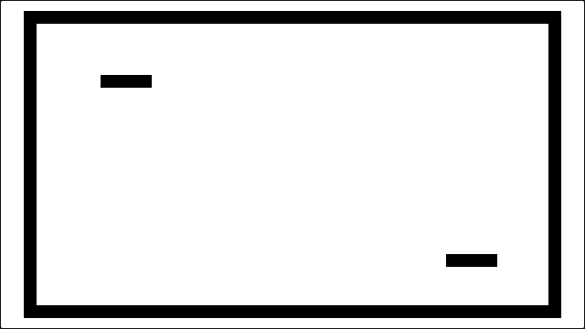](metadata/screenshots/TRON.png) |
| UFO Race | Rodot | None | ✅ | [UFO Race](https://github.com/Rodot/UFO-Race) |  |
| Under the Tower | wuuff | GPLv3 | ✅ | [under the tower](https://github.com/wuuff/under-the-tower) |  |
| Video Poker | Mike Del Pozzo | GPLv3 | ✅ | [videopoker gamebuino](https://github.com/delpozzo/videopoker-gamebuino) |  |
| Walbloks | borkin8r | None | — | [walbloks](https://github.com/borkin8r/walbloks) | [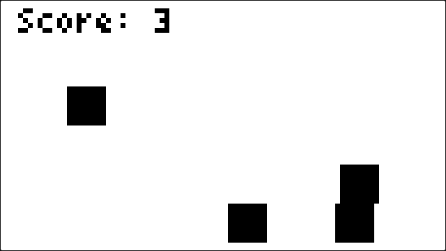](<metadata/screenshots/WALBLOKS.png>) |
| Wolfenduino 3D | jhhoward | None | — | [Wolfenduino](https://github.com/jhhoward/Wolfenduino) |  |
| World's Hardest Game | Sorunome | None | ✅ | [Worlds Hardest Game Gamebuino](https://github.com/Sorunome/Worlds-Hardest-Game-Gamebuino) |  |
| Xonix | Tnxec2 | None | — | [xonix gamebuino](https://github.com/Tnxec2/xonix-gamebuino) | [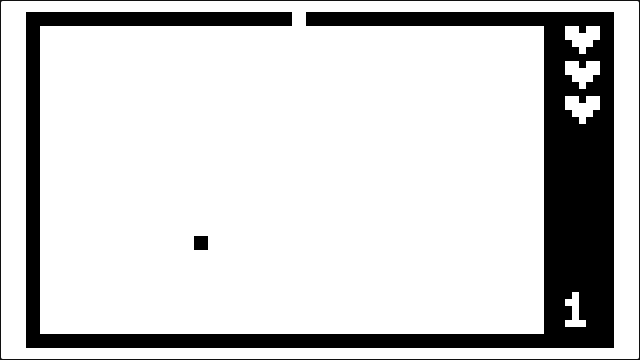](metadata/screenshots/XONIX.png) |
| ZombiEscape | Frakasss | None | — | [ZombiEscape](https://github.com/Frakasss/ZombiEscape) | [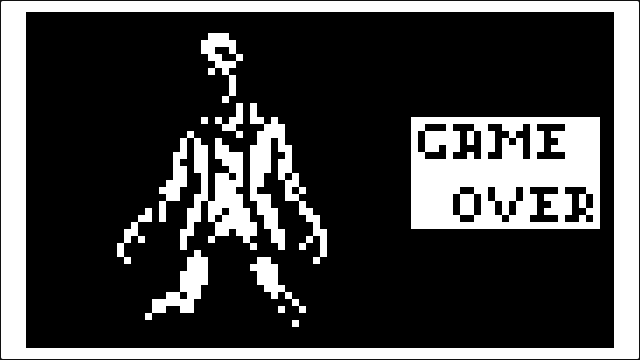](metadata/screenshots/ZOMBIESCAPE.png) |

## Credits / References

- [Gamebuino Classic library](https://github.com/Gamebuino/Gamebuino-Classic)
  (Aurélien Rodot, LGPLv3) - this project's own `gamebuinoShim.h`/`.c`
  reproduces its real API (buttons, display, sound) on top of Vircon32, and
  its own real `font5x7`/`font3x5`/`font3x3` bitmap fonts are ported
  verbatim for text rendering.
- [Gamebuino Classic](https://github.com/Gamebuino) - the original
  hardware/company this library targets.
- Each game in the table above links to its own original source repo and
  author - see that repo/the game's own header comment in `src/games/` for
  its own license and full credit.
- [Vircon32](https://www.vircon32.com/) - the fantasy console this
  cartridge targets.
- [tinyjoypad_vircon32](https://github.com/joyrider3774/tinyjoypad_vircon32) - the sibling project this
  one's menu system, column-atlas rendering trick, and general porting
  methodology are directly reused from.
